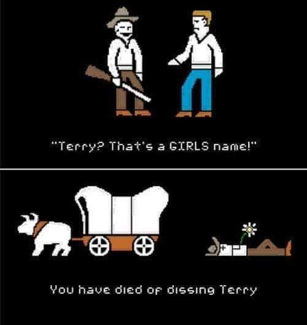

<!doctype html>
<html lang="en">
  <head>
    <!-- Required meta tags -->
    <meta charset="utf-8">
    <meta name="viewport" content="width=device-width, initial-scale=1, shrink-to-fit=yes">
    <!-- Dancing Script (Google Fonts) -->
    <link href="https://fonts.googleapis.com/css?family=Dancing+Script&display=swap" rel="stylesheet">
    <!-- Bootstrap CSS -->
    <link rel="stylesheet" href="https://stackpath.bootstrapcdn.com/bootstrap/4.3.1/css/bootstrap.min.css" integrity="sha384-ggOyR0iXCbMQv3Xipma34MD+dH/1fQ784/j6cY/iJTQUOhcWr7x9JvoRxT2MZw1T" crossorigin="anonymous">
    <!-- CSS File -->
    <link rel="stylesheet" href="styles.css">
    <!-- Font Awesome     -->
    
    <title>Omni</title>
  </head>
  <body>
    <header>
      <!-- Navigation Bar -->
      <nav class="navbar navbar-expand-lg navbar-fixed-top">
        

          

            <a class="navbar-brand">Omni</a>
          

          <button class="navbar-toggler" type="button" data-toggle="collapse" data-target="#navTogglerBlah" aria-controls="navTogglerBlah" aria-expanded="false" aria-label="Toggle navigation">
            
          </button>
          

            <ul class="navbar-nav ml-auto">
              <li class="nav-item">
                  <a class="nav-link" href="main.html">Home</a>
              </li>
              <li class="nav-item">
                  <a class="nav-link" href="blog.html">Blog</a>
              </li>
              <li class="nav-item">
                  <a class="nav-link" href="https://laney.edu/gateway/">GtC</a>
              </li>
              <li class="nav-item dropdown">
                <a class="nav-link dropdown-toggle" id="navbarDropdown" role="button" data-toggle="dropdown" aria-haspopup="true" aria-expanded="false">
                  Resources
                </a>
                

                  <a class="dropdown-item" href="https://github.com/">GitHub</a>
                  <a class="dropdown-item" href="https://developer.mozilla.org/en-US/docs/Learn">MDN Web Docs</a>
                  <a class="dropdown-item" href="https://www.w3schools.com/default.asp">W3 Schools</a>
                  

                  <a class="dropdown-item" href="https://www.freecodecamp.org/">FreeCodeCamp</a>
                

              </li>
            </ul>
          

        

      </nav>
    </header>

    <!-- Carousel Section -->
    

    <!-- Indicators -->
      <ul class="carousel-indicators">
        <li data-target="#imgCarousel" data-slide-to="0" class="active"></li>
        <li data-target="#imgCarousel" data-slide-to="1"></li>
        <li data-target="#imgCarousel" data-slide-to="2"></li>
      </ul>
      
      <!-- The slideshow -->
      

        

          
          

            <h3></h3>
            
Some memes are decent

          

        

      

       <a href="https://www.choosechicago.com/">
        

            <!-- <h3>Chicago</h3>
            
The hometown
 -->
        

      </a>
      

      

       <!--  -->
        <h2 style="padding-top: 7rem;">Banner Images Will Go Here</h2>
      

      
      <!-- Left and right controls -->
      <a class="carousel-control-prev" href="#imgCarousel" role="button" data-slide="prev">
        
        Previous
      </a>
      <a class="carousel-control-next" href="#imgCarousel" data-slide="next">
        
        Next
      </a>
    

  

    <!-- Test code for rotating words -->
    <section class="rw-wrapper">
      <h2 class="rw-sentence">
          I've created this space in order to
           
          

              improve skills
              explore thoughts
              record my adventures
              share resources
              some reason
              another reason
          

           
           
          and this section
             
            would have
          

              information
              catchy words
              colors
              attention grabbers
              thoughful phrases
              the occasional typo
          

      </h2>
  </section>

    <!-- Image that changes based on the size of screen -->
  <!-- <picture>
      <source srcset="images\webdevforums.png" media="(max-width: 600px)">
      <source srcset="images\gateway2collegeLogo-250px.png" media="(max-width: 1500px)">
      <source srcset="images\web_dot_dev.png">
      
    </picture> -->

    <!-- CARDS -->
    

      

        

          <a href="#">
            

              <!--  -->
              

                
                  <h2 class="card-title">Title!</h4>                
              

            </a>
            

        

        
        

          <a href="#">
            

              
              

                
                  <h2 class="card-title">CARD TITLE</h4>                
              

            </a>
          

        

      <!--  
       
      

        

          Two
        

        

          Two
        

        

          Two
        

      
       -->
    

    <footer>
      
Contact Info:

      <ul>
        <li><a href="https://www.facebook.com/terbenaw"><i class="fab fa-facebook fa-2x" aria-hidden="true"></i></a></li>
        <li><a href="https://www.linkedin.com/in/terrybwatson/"><i class="fab fa-linkedin fa-2x" aria-hidden="true"></i></a></li>
        <li><a href="https://twitter.com/Omnitheas"><i class="fab fa-twitter fa-2x" aria-hidden="true"></i></a></li>
        <li><a href="https://github.com/tbenjaminwatson"><i class="fab fa-github fa-2x" aria-hidden="true"></i></a></li>
        <li><a href="mailto:terbenaw@gmail.com"><i class="fas fa-envelope fa-2x" aria-hidden="true"></i></a></li>

      </ul>
    </footer>

    <!-- Optional JavaScript -->
    <!-- jQuery first, then Popper.js, then Bootstrap JS -->
    
    
    
  </body>
</html>